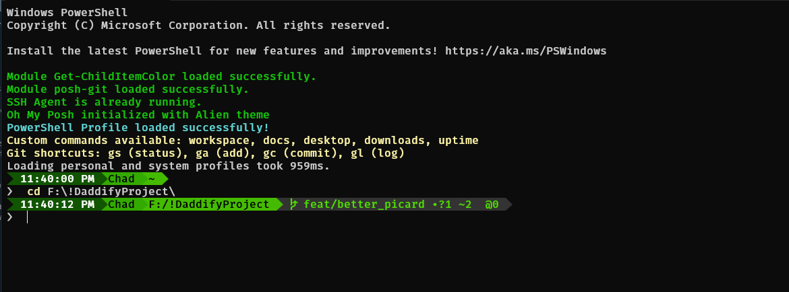

# Alien PowerShell Theme

A custom PowerShell prompt theme inspired by the [alien theme](https://github.com/eendroroy/alien) from Oh My ZSH, adapted for Windows PowerShell using Oh My Posh.

## Screenshots



## Features

- **Two-line prompt** with command input on the second line
- **Error status indicator** that shows "!" when the previous command failed
- **Current time display** in the prompt
- **Battery status** with charging/discharging icons
- **Username display**
- **Current path** with full directory structure
- **Git integration** showing:
  - Current branch
  - Working directory status (modified files)
  - Number of commits behind remote
- **Color-coded prompt character** (❯) that changes from green to red based on command success/failure
- **Powerline-style** segment separators for a clean, modern look

## Prerequisites

- [Windows PowerShell](https://docs.microsoft.com/en-us/powershell/) 5.1 or later
- [Oh My Posh](https://ohmyposh.dev/) - A prompt theme engine for any shell
- A [Nerd Font](https://www.nerdfonts.com/) or [Powerline-patched font](https://github.com/powerline/fonts) (the configuration uses "Fira Mono for Powerline")
- PowerShell modules:
  - [posh-git](https://github.com/dahlbyk/posh-git) - Git integration for PowerShell
  - [Get-ChildItemColor](https://github.com/joonro/Get-ChildItemColor) - Colorized directory listings

## Installation

### 1. Install Required Software

```powershell
# Install Oh My Posh using winget
winget install JanDeDobbeleer.OhMyPosh

# Install required PowerShell modules
Install-Module -Name posh-git -Scope CurrentUser -Force
Install-Module -Name Get-ChildItemColor -Scope CurrentUser -Force
```

### 2. Install a Compatible Font

Download and install a Powerline-compatible font like [Fira Mono for Powerline](https://github.com/powerline/fonts/tree/master/FiraMono).

### 3. Set Up the Theme

1. Create a Themes directory in your PowerShell profile directory:

```powershell
New-Item -ItemType Directory -Path "$HOME\OneDrive\Documents\WindowsPowerShell\Themes" -Force
```

2. Save the `alien.omp.json` theme file to this directory:

```powershell
# Path should be:
# $HOME\OneDrive\Documents\WindowsPowerShell\Themes\alien.omp.json
```

3. Update your PowerShell profile to use the theme:

```powershell
# Add this to your PowerShell profile ($PROFILE)
$customThemePath = "$HOME\OneDrive\Documents\WindowsPowerShell\Themes\alien.omp.json"
oh-my-posh init pwsh --config $customThemePath | Invoke-Expression
```

### 4. Configure Your Terminal

If using Windows Terminal, add the following to your settings.json:

```json
{
    "profiles": {
        "defaults": {
            "fontFace": "Fira Mono for Powerline"
        }
    }
}
```

## Customization

The theme can be customized by editing the `alien.omp.json` file. Here are some common customizations:

### Change Colors

Modify the `foreground` and `background` properties in each segment to change colors.

### Modify Segments

Add, remove, or reorder segments in the `blocks` array to change what information is displayed in your prompt.

### Change Icons

Update the icon properties in various segments to use different symbols or characters.

## Helpful Aliases and Functions

The PowerShell profile includes several helpful aliases and functions:

- `workspace` - Navigate to your workspace directory
- `docs`, `desktop`, `downloads` - Quick navigation to common folders
- `gs`, `ga`, `gc`, `gl` - Git shortcuts for status, add, commit, and log
- `uptime` - Display system uptime
- `ll`, `ls` - Colorized directory listings

## Credits

- Original [alien theme](https://github.com/eendroroy/alien) for Oh My ZSH by [eendroroy](https://github.com/eendroroy)
- [Oh My Posh](https://ohmyposh.dev/) by [Jan De Dobbeleer](https://github.com/JanDeDobbeleer)
- [posh-git](https://github.com/dahlbyk/posh-git) for PowerShell Git integration

## License

[MIT License](LICENSE)